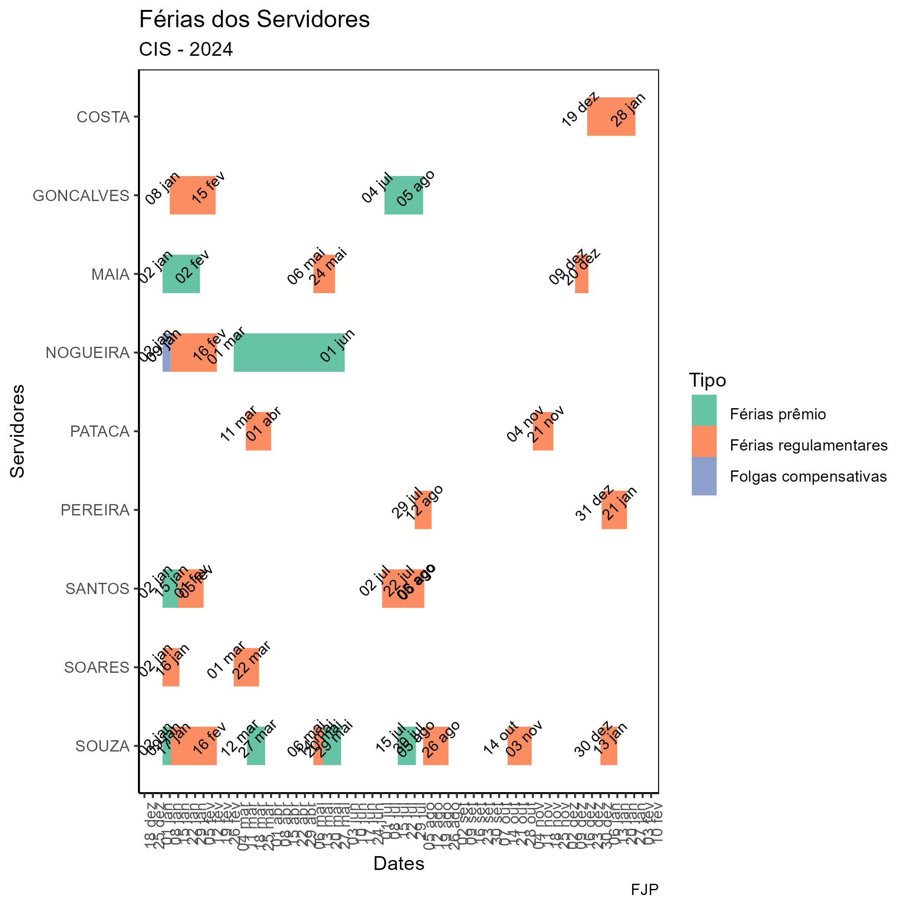

{width=50%}

## Visão Geral

Graáfico para visualizar dados de férias de funcionários usando as bibliotecas `matplotlib` e `seaborn`. O código R original cria um gráfico para exibir os períodos de férias de funcionários em uma organização específica (CIS) para o ano de 2024.

## Pré-requisitos

Certifique-se de ter as seguintes bibliotecas Python instaladas:

```bash
pip install pandas matplotlib seaborn
```

## Uso

1. Baixe o arquivo de dados de férias dos funcionários (`CIS_Ferias_2024.xlsx`) para o mesmo diretório do script em Python.

2. Execute o script Python:

```bash
python seu_script.py
```

3. O gráfico será gerado e salvo como um arquivo PDF chamado `ferias_cis.pdf` no mesmo diretório.

## Visualização

A imagem abaixo ilustra o gráfico gerado pelo script:


```
